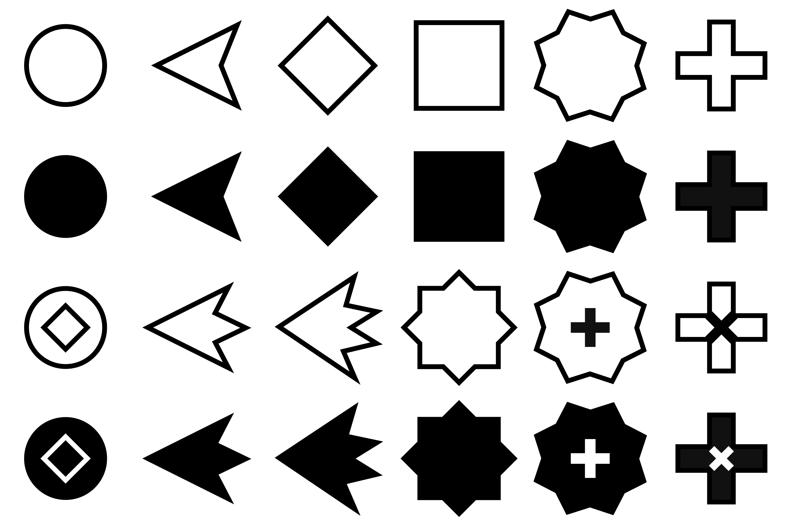

# Nsp's chess pieces
Minimalistic chess set, including 5D-specific pieces

## List of Pieces

in reading order, with corresponding notation: 

#### Standard (top)

- Pawn (P)
- Knight (N)
- Bishop (B)
- Rook (R)
- Queen (Q)
- King (K)

#### 5D-specific (bottom)

- Brawn (W; pawn with more 'diagonal' moves)
- Unicorn (U; moves 'triagonally')
- Dragon (D; moves 'quadragonally')
- Princess (S; bishop + rook, but not unicorn and dragon)
- Royal queen (Y)
- Common king (C; a non-royal piece with king's movability)

## Files & Usage

- `pieces.png` includes `PNBRQK/WUDSYC` in a format used by 5D Chess client.
  to use in 5D Chess, you should not change the file's name, dimension and color mode.
- Individual pieces (svg or png) could be uploaded.
- License: CC BY-SA 4.0

## Design

This piece set is inspired by 'Shapes' piece set used in lichess.

Instead of pieces pointing to where they could go, here they face the direction with their edges.
Coupled with more solid insides, this builds smooth motion when animated (IMO). Mainly affects R/B/princess.

Rook + bishop produces a 2D queen (a princess), and 5D queen is modified from it to reflect the possibilities.

Knight, unicorn and dragon has different tails, and unicorn/dragon's tail matches the amount of dimensions they use at once.

## Acknowledgements

For 5D pieces and notation, see also [adri326/5dchess-notation](https://github.com/adri326/5dchess-notation#moves)

Got it work in the client by the help from the 5D Chess Community <3
